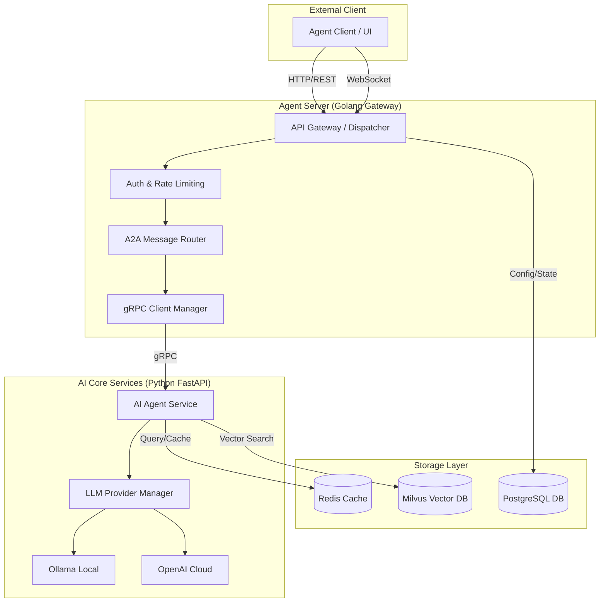

# DESIGN_agent-server-sample

## 1. 整体架构图

## 2. 分层设计和核心组件

### 2.1. 网关层 (Golang)
- **API Gateway**: 统一入口，支持 HTTP 和 WebSocket。
- **A2A Router**: 根据 `receiver_id` 路由消息。
- **gRPC Manager**: 管理与后端 Python 服务的连接池。

### 2.2. 业务层 (Python)
- **FastAPI Service**: 提供 AI 核心能力。
- **LLM Adapter**: 统一封装不同厂商的 LLM 接口（Ollama, OpenAI）。
- **A2A Handler**: 处理 A2A 协议的消息逻辑。

### 2.3. 存储层
- **Redis**: 存储会话上下文、短期缓存、消息队列。
- **PostgreSQL**: 存储 Agent 配置、用户数据、持久化日志。
- **Milvus**: 存储 Embedding 向量，支持 RAG 检索。

## 3. 接口契约定义

### 3.1. 外部接口 (HTTP/WebSocket)
- `POST /api/v1/a2a/message`: 发送单次 A2A 消息。
- `WS /ws/v1/a2a/stream`: 建立 A2A 流式通信长连接。

### 3.2. 内部接口 (gRPC)
- `service AgentService { rpc ProcessMessage (A2AMessage) returns (A2AMessage); }`
- `service AgentService { rpc StreamMessage (stream A2AMessage) returns (stream A2AMessage); }`

## 4. 数据流向图

1. **Client** 发送 HTTP 请求或通过 WS 发送消息。
2. **Golang Gateway** 接收并验证消息。
3. **Gateway** 将消息封装为 A2A 结构并通过 **gRPC** 转发给 **Python Service**。
4. **Python Service** 调用 **LLM** 处理（或检索 **Milvus**）。
5. **Python Service** 通过 gRPC 返回响应。
6. **Gateway** 通过 HTTP 或 WS 将结果返回给 **Client**。

## 5. 异常处理策略
- **重试机制**: gRPC 调用失败时进行指数退避重试。
- **降级处理**: 当 AI 模型不可用时，返回预设的友好提示或切换备用模型。
- **连接管理**: WebSocket 自动心跳检测和断线重连。