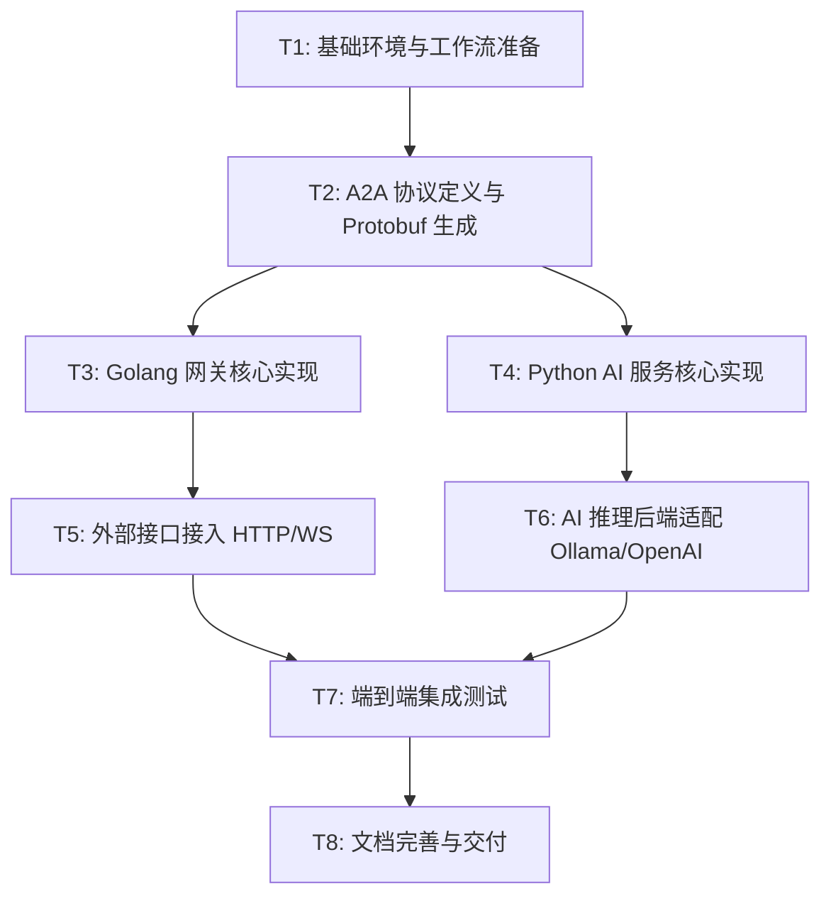

# TASK_agent-server-sample

## 1. 任务依赖图

## 2. 原子任务拆分

### T1: 基础环境与工作流准备
- **输入**: 项目根目录、git-agent 脚本。
- **输出**: 初始化后的开发分支和物理目录。
- **验收标准**: 能通过 git-agent 成功创建 `feature/core-framework` 分支及其物理目录。

### T2: A2A 协议定义与 Protobuf 生成
- **输入**: A2A 协议规范文档。
- **输出**: `proto/a2a.proto` 文件及生成的 Go/Python 代码。
- **验收标准**: Protobuf 文件包含核心消息结构，且 Go/Python 代码生成无误。

### T3: Golang 网关核心实现
- **输入**: T2 生成的代码、gRPC 框架。
- **输出**: Golang 网关基础框架。
- **验收标准**: 网关能启动并监听 gRPC/HTTP 端口。

### T4: Python AI 服务核心实现
- **输入**: T2 生成的代码、FastAPI 框架。
- **输出**: Python AI 服务基础框架。
- **验收标准**: AI 服务能启动并成功向网关注册或被网关发现。

### T5: 外部接口接入 (HTTP/WS)
- **输入**: T3 基础网关。
- **输出**: HTTP REST 接口和 WebSocket 流式接口。
- **验收标准**: 外部客户端能通过 HTTP 发送 A2A 消息，并通过 WS 接收流式数据。

### T6: AI 推理后端适配 (Ollama/OpenAI)
- **输入**: T4 基础 AI 服务。
- **输出**: Ollama 和 OpenAI 的 Adapter 实现。
- **验收标准**: AI 服务能根据配置动态切换本地/云端推理后端。

### T7: 端到端集成测试
- **输入**: T5 和 T6 的交付物。
- **输出**: 测试报告。
- **验收标准**: Client -> Gateway -> AI Service -> LLM -> Client 的完整链路通畅，延迟符合预期。

### T8: 文档完善与交付
- **输入**: 所有实现代码和测试结果。
- **输出**: API 参考手册、部署指南、项目总结报告。
- **验收标准**: 文档内容详实，符合项目规则（中文编写）。

## 3. 复杂度评估与优先级
- **高优先级**: T1, T2, T3, T4 (核心链路)
- **中优先级**: T5, T6 (功能扩展)
- **低优先级**: T7, T8 (收尾工作)

## 4. 下一步计划
- 进入 **阶段 4: Approve (审批阶段)**，确认任务计划。
- 随后进入 **阶段 5: Automate (自动化执行)**，开始执行 T1 任务。